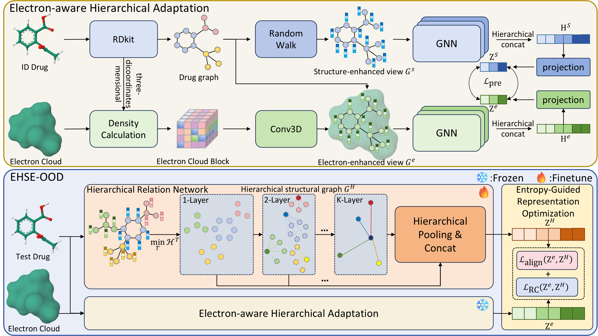

# EHSE-OOD

**Electron-aware Hierarchical Adaptation and Structural Entropy-Guided Representation Optimization for Molecular Out-of-Distribution Detection**

EHSE-OOD is a molecular out-of-distribution (OOD) detection framework that jointly models **molecular topology** and **electron-cloud information**. The framework contains two stages:

1. **Electron-aware Hierarchical Adaptation (EHA)** for molecular representation pretraining.
2. **Structural Entropy-Guided Representation Optimization (SERO)** for test-time OOD detection.

The central idea is that molecular distribution shifts are not caused only by changes in graph topology, but can arise from joint changes in structural and electronic spaces. EHSE-OOD therefore learns electron-aware molecular representations during pretraining and uses a structural-entropy-guided hierarchical representation at inference time to reduce the influence of distribution-irrelevant structural patterns.

The implementation supports experiments on **DrugOOD** and **OGB molecular datasets**, and provides **GIN**, **GCN**, and **GraphSAGE** backbones.

---

## Overview

EHSE-OOD follows the workflow below.



### Stage 1: Electron-aware Hierarchical Adaptation

For each molecule, two complementary graph views are constructed.

- **Electron-enhanced view**: atom features are augmented with local electron-cloud features. A lightweight 3D CNN encodes an electron-density patch centered on each atom, and the resulting electronic feature is concatenated with the original atomic attributes.
- **Structure-enhanced view**: the molecular graph itself is not randomly perturbed. Instead, each atom is augmented with **random-walk structural encoding (RWSE)** and **degree structural encoding (DGSE)**.

The two views are processed by independent GNN encoders. Graph representations from all GNN layers are concatenated and projected into a shared latent space. A graph-level contrastive objective aligns the electron-enhanced and structure-enhanced representations of the same molecule while separating different molecules.

### Stage 2: Structural Entropy-Guided Representation Optimization

At inference time, EHSE-OOD constructs a **Hierarchical Structural Graph (HSG)** using a coding-tree transformation guided by structural entropy. A **Hierarchical Relation Network (HRN)** performs bottom-up message aggregation over the HSG and pools representations from multiple hierarchy levels.

The pretrained EHA representation is used as a stable electron-aware reference, while the HRN representation is optimized on test batches. The resulting representation inconsistency is used as the OOD signal. In the implementation, the test-time objective combines a cross-view alignment term with a conditional relation constraint.

A larger optimization loss indicates that a test molecule is more difficult to align with the representation space learned from in-distribution molecules and is therefore more likely to be OOD.

---

## Project Structure

```text
EHSE-OOD/
├── Dataload/
│   ├── DrugOOD_Dataloader.py      # DrugOOD loading, RWSE/DGSE and HSG preprocessing
│   ├── OGB_Dataloader.py          # OGB loading and cross-dataset OOD construction
│   ├── GOOD_Dataloader.py         # Additional graph data loader
│   ├── Get_ECloud_Data.py         # Electron-cloud generation and atom-centered patch extraction
│   ├── codingTree.py              # Structural-entropy coding tree / hierarchical graph construction
│   ├── data_loader.py
│   └── aug.py
│
├── ecloud_utils/
│   ├── cubtools.py
│   ├── grid.py                    # Electron-density grid utilities
│   ├── htmd_utils.py
│   ├── rotation.py                # Random 3D molecular rotation
│   └── xtb_density.py             # xTB-based electron-density calculation
│
├── model/
│   ├── model.py                   # EHA model for DrugOOD
│   ├── model_OGB.py               # EHA model for OGB
│   ├── ecloud_encoder.py          # 3D CNN electron-cloud encoder
│   ├── t_encoder.py               # HRN / hierarchical representation encoder
│   ├── GNNs.py                    # GIN / GCN graph backbones
│   ├── SAGE.py                    # GraphSAGE backbones
│   └── GNNConv.py
│
├── utils/
│   ├── chem.py                    # RDKit molecular geometry utilities
│   ├── smiles2graph.py            # SMILES-to-graph conversion
│   ├── metrics.py
│   ├── admet_metrics.py
│   ├── common.py
│   ├── pdb_parser.py
│   └── utils.py
│
├── main_DrugOOD.py                # DrugOOD experiments
├── main_OGB.py                    # OGB cross-dataset experiments
├── pre_train.py                   # EHA pretraining routine
├── environment.yml                # Conda environment
└── model.pdf                      # Model architecture figure
```

---

## Requirements

The provided environment is based on **Python 3.7**, **PyTorch 1.9.1 + CUDA 11.1**, and **PyTorch Geometric 2.0.3**.

Create the environment with:

```bash
conda env create -f environment.yml
conda activate py37
```

Important packages include:

- PyTorch / PyTorch Geometric
- OGB
- RDKit
- scikit-learn
- SciPy
- NetworkX
- MMCV
- ASE
- PySCF

Electron-density preprocessing additionally requires an **xTB executable**.

## Data Preparation

### 1. DrugOOD

The first step is to generate the original dataset from CHEMBL database. As for the detailed process or operation, please refer to the  [DrugOOD](https://github.com/tencent-ailab/DrugOOD)  repository. The generated ```json```  files should be put into folder ```DrugOOD/data/ic50``` or ```DrugOOD/data/ec50``` respectively.

With the default `--data-root ./data/`, the expected organization is:

```text
data/
└── DrugOOD/
    ├── ic50/
    │   ├── scaffold/
    │   │   └── lbap_general_ic50_scaffold.json
    │   ├── size/
    │   └── assay/
    └── ec50/
        ├── scaffold/
        ├── size/
        └── assay/
```

The loader uses the DrugOOD training split as the ID pool and the `ood_test` split as the OOD pool. 

### 2. OGB

The code supports cross-dataset molecular OOD detection with OGB datasets. The experiments reported in the paper use:

```text
ogbg-molhiv  -> ogbg-molbbbp
ogbg-molhiv  -> ogbg-molbace
ogbg-molbbbp -> ogbg-molbace
```

With the default configuration, OGB datasets are stored under:

```text
data/
└── OGB/
    ├── ogbg_molhiv/
    ├── ogbg_molbbbp/
    └── ogbg_molbace/
```

The standard OGB graph-property datasets are downloaded/processed through the OGB package

---

## Electron-Cloud Preprocessing

Eectron-cloud informations are generated in `Dataload/Get_ECloud_Data.py`.

```text
python Get_ECloud_Data.py
```

The preprocessing pipeline is:

1. Generate a 3D molecular conformation with RDKit.
2. Apply a random 3D rotation.
3. Calculate electron density using xTB.
4. Interpolate the density onto a regular 3D grid.
5. Extract an atom-centered **5 × 5 × 5** density patch for each atom.
6. Store the patches in a `.pt` file indexed by SMILES.

Before running electron-cloud generation, update the xTB executable path in:

```python
Dataload/Get_ECloud_Data.py
```

In particular, replace the machine-specific path used to construct `CDCalculator` with the path to your local xTB executable.

The preprocessing script currently provides helper functions for generating DrugOOD and OGB electron-cloud files. For example:

```python
get_save_all_DrugOOD_Ecloud_data()
get_save_all_OGB_Ecloud_data()
```

Select the function corresponding to the datasets you want to preprocess before running, Electron-cloud generation can be time-consuming, but it is performed only during data preprocessing and does not add xTB computation to online inference.

---

## Structural Encoding

EHSE-OOD uses an undisturbed structure-enhanced view rather than deleting atoms or bonds.

For each atom, the code constructs:

- **RWSE**: diagonal return probabilities of random walks at multiple step lengths.
- **DGSE**: one-hot encoding of the node degree.

## Hierarchical Structural Graph

`Dataload/codingTree.py` constructs the hierarchical graph used by the Structural Entropy-Guided Representation Optimization stage.

The transformation organizes atoms into a fixed-depth hierarchy and stores the hierarchical relations as `tEdgeMatLayer*`, `tPHLayer*`, and related tensors used by `HRNEncoder`.

The HRN aggregates information bottom-up across the hierarchy, performs graph pooling at multiple levels, concatenates the pooled features, and projects the result into the same representation dimension as the pretrained EHA encoder.

---

## Pretraining

Pretraining aligns the electron-enhanced and structure-enhanced graph representations using a symmetric graph-level contrastive objective.

```text
python pre_train.py
```

In normal experiments, it is not necessary to run `pre_train.py` manually. Both main scripts check whether a pretrained checkpoint already exists. If not, pretraining is launched automatically before OOD inference.

The pretrained model is saved to:

```text
result/pretrain/<dataset>/<dataset_name>/<backbone>/<seed>/pre_train_model.pth
```

For example:

```text
result/pretrain/DrugOOD/ic50_scaffold/GCN/1/pre_train_model.pth
```

The pretraining objective is a symmetric graph-level contrastive loss between the two molecular views. The current implementation uses a contrastive temperature of `0.2` unless another value is explicitly passed to `pretrain()`.

---

## Test-Time Representation Optimization

### Running EHSE-OOD on DrugOOD
```text
python main_DrugOOD.py
```

### Running EHSE-OOD on OGB
```text
python main_OGB.py
```

For each test batch, EHSE-OOD:
1. obtains the frozen EHA representation of each molecule;
2. constructs the HSG representation using the HRN;
3. aligns the HRN representation with the pretrained electron-aware representation;
4. applies the conditional relation constraint;
5. uses the resulting sample-wise optimization loss as the OOD score.

The implementation reports:

- **AUROC**
- **AUPR**

where OOD molecules are assigned label `1` and ID molecules label `0`.


## DrugOOD Experiments

Run EHSE-OOD on DrugOOD with:

```bash
python main_DrugOOD.py \
  --dataset_name ic50_scaffold \
  --base_backend_type GCN \
  --use_ecloud True
```

Available DrugOOD experiment names are:

```text
ic50_scaffold
ic50_size
ic50_assay
ec50_scaffold
ec50_size
ec50_assay
```

Available backbones are:

```text
GIN
GCN
SAGE
```

A typical configuration corresponding to the main EHSE-OOD setting is:

```bash
python main_DrugOOD.py \
  --gpu-id 0 \
  --dataset_name ic50_scaffold \
  --base_backend_type GCN \
  -num_layer 5 \
  -hidden_dim 128 \
  -rw_dim 16 \
  -dg_dim 16 \
  --t_depth 5 \
  --ecloud_dim 64 \
  --use_ecloud True \
  -gamma 0.1
```

The script evaluates five random seeds:

```text
1, 5, 42, 7, 2026
```

Per-seed results are saved to:

```text
result/DrugOOD/<dataset_name>/<backbone>/<seed>/result.json
```

and the mean/std summary is saved to:

```text
result/DrugOOD/<dataset_name>/<backbone>/avg_result.json
```

---

## OGB Experiments

Run cross-dataset OOD detection with:

```bash
python main_OGB.py \
  --dataset_name ogbg-molhiv \
  ---ood_dataset_name ogbg-molbbbp \
  --base_backend_type GCN
```

Examples used in the paper are:

```bash
# OGB-HIV -> OGB-BBBP
python main_OGB.py \
  --dataset_name ogbg-molhiv \
  ---ood_dataset_name ogbg-molbbbp \
  --base_backend_type GCN

# OGB-HIV -> OGB-BACE
python main_OGB.py \
  --dataset_name ogbg-molhiv \
  ---ood_dataset_name ogbg-molbace \
  --base_backend_type GCN

# OGB-BBBP -> OGB-BACE
python main_OGB.py \
  --dataset_name ogbg-molbbbp \
  ---ood_dataset_name ogbg-molbace \
  --base_backend_type GIN
```

> **Argument-name note:** the current `main_OGB.py` defines `---ood_dataset_name` with **three leading hyphens**. The commands above follow the current source code exactly. If this option is renamed to `--ood_dataset_name`, update the commands accordingly.

Per-seed OGB results are saved to:

```text
result/OGB/<ID_dataset>+<OOD_dataset>/<backbone>/<seed>/result.json
```

and the aggregated result is saved to:

```text
result/OGB/<ID_dataset>+<OOD_dataset>/<backbone>/avg_result.json
```

---


## Main Hyperparameters

The default main-script configuration includes:

| Parameter | Meaning | Default |
|---|---|---:|
| `num_layer` | Number of GNN layers | 5 |
| `hidden_dim` | GNN hidden dimension | 128 |
| `rw_dim` | Random-walk encoding dimension | 16 |
| `dg_dim` | Degree encoding dimension | 16 |
| `ecloud_dim` | Electron-cloud embedding dimension | 64 |
| `t_depth` | HSG / HRN hierarchy depth | 5 |
| `batch_size` | Pretraining batch size | 128 |
| `batch_size_test` | Test batch size | 800 |
| `lr` | EHA learning rate | 1e-4 |
| `t_learning_rate` | HRN test-time learning rate | 1e-3 |
| `pre_epochs` | Maximum pretraining epochs | 500 |
| `num_epoch` | Test-time optimization epochs | 400 |
| `gamma` | Conditional relation loss weight | 0.1 |

The paper studies the sensitivity of the GNN depth, HSG depth, loss-balancing coefficient, and contrastive temperature. When reproducing a specific table or ablation, please use the exact configuration associated with that experiment.

---

## Evaluation Protocol

The implementation performs five runs using different random seeds and reports the mean and standard deviation of AUROC and AUPR.

For DrugOOD, the evaluation covers three realistic distribution-shift settings:

- **Scaffold shift**
- **Size shift**
- **Assay shift**

For OGB, distribution shift is constructed across different molecular datasets.

The paper compares EHSE-OOD with representative molecular / graph OOD and graph anomaly detection methods, including MSP, GOOD-D, GraphDE, AAGOD, OCGIN, GLocalKD, SpectralGap, PGR-MOOD, SA-Diff, and APEKG.

---

## Reproducibility Notes

For reproducible experiments, please check the following before running the code:

- Use the provided `environment.yml` or an equivalent compatible environment.
- Make sure the DrugOOD / OGB files are placed under the paths expected by the loaders.
- Generate the electron-cloud `.pt` files before starting experiments.
- Update the local xTB executable path in `Dataload/Get_ECloud_Data.py`.
- Keep the electron-cloud dictionary keyed by the exact SMILES strings used by the corresponding dataset.
- Use the same random seeds as the main scripts when comparing with the reported results.
- Keep `rw_dim`, `dg_dim`, GNN depth, HSG depth, and backbone consistent with the target experiment.
- Remove previously processed PyG/HSG cache files if the raw data, electron-cloud files, or preprocessing settings are changed.

The main scripts save both individual OOD scores and labels in `result.json`, which can be used for additional analysis and visualization.

## Acknowledgements

This implementation builds on widely used open-source resources for molecular graph learning and chemistry, including PyTorch Geometric, OGB, RDKit, DrugOOD, and xTB.

---

## Contact

For questions about the code or experiments, please open an issue in the project repository.

